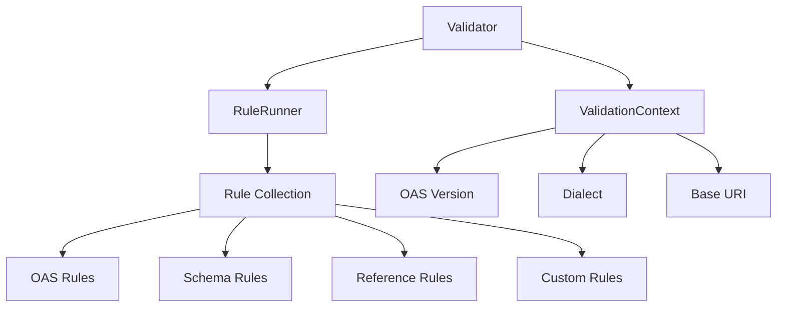

# Validator

## Overview

The SwiftOpenAPISpec validator provides comprehensive validation for OpenAPI documents, ensuring they conform to the OpenAPI Specification (OAS) standards. The validation system is designed to be flexible, extensible, and thorough, covering both structural aspects and schema definitions.

### Key Features

- **Rule-Based Validation**: Uses a collection of rules that can be easily extended
- **Multi-Version Support**: Validates OAS 3.0, 3.1, and 3.2 documents
- **Comprehensive Coverage**: Checks structure, schemas, references, and more
- **Detailed Diagnostics**: Provides clear, actionable validation messages
- **Asynchronous Processing**: Supports complex reference resolution

## Validation Architecture

The validation system follows a modular architecture:



### Core Components

1. **`Validator`**: The main entry point that orchestrates the validation process
2. **`RuleRunner`**: Executes the collection of validation rules
3. **`ValidationContext`**: Provides configuration and context for validation
4. **`Rule` Protocol**: Defines the interface that all validation rules implement
5. **Diagnostics**: Collects and reports validation findings

## Validation Process

### Step-by-Step Workflow

1. **Initialization**: Create a validation context with the appropriate OAS version
2. **Rule Selection**: Use the default rule set or customize with specific rules
3. **Execution**: Run the validator against the OpenAPI document
4. **Analysis**: Review the diagnostics for validation findings
5. **Resolution**: Address any issues found during validation

### Example Usage

```swift
import SwiftOpenAPISpec

// Load an OpenAPI specification
let url = URL(fileURLWithPath: "path/to/openapi.yaml")
let spec = try await OpenAPISpecification.read(url: url, documentLoader: YamsDocumentLoader())

// Create validation context
let version = try ValidationContext.OASVersion.fromString(spec.version ?? "3.1.0")
let ctx = ValidationContext(
    version: version,
    dialect: version.dialect,
    baseURI: url.absoluteString,
    operationIds: []
)

// Initialize resolver
var resolver = JSONPointerResolver(baseURL: url, loadDocument: YamsDocumentLoader().load(from:))

// Run validation
var diagnostics = try await Validator.validate(
    spec: spec,
    baseURI: url.absoluteString,
    ctx: ctx,
    resolver: &resolver
)

// Process results
if diagnostics.isEmpty {
    print("Validation: OK")
} else {
    print("Validation issues found:")
    for diagnostic in diagnostics {
        print("- [\(diagnostic.severity)] \(diagnostic.message) at \(diagnostic.pointer)")
    }
}
```

## Rule System

### Rule Types

The validator uses different types of rules to cover all aspects of OpenAPI validation:

#### OAS Rules

These rules validate the structural aspects of OpenAPI documents:

- **`SupportedVersion3`**: Validates that the document uses a supported OAS version
- **`InfoObjectRules`**: Validates the Info object structure and required fields
- **`PathsObjectRules`**: Validates the Paths object and path items
- **`OperationObjectRules`**: Validates operation definitions
- **`ParameterRules`**: Validates parameter definitions
- **`RequestBodyRules`**: Validates request body definitions
- **`ResponseRules`**: Validates response definitions
- **`SchemaRules`**: Validates schema definitions
- **`ComponentsRules`**: Validates the Components object

#### Schema Rules

These rules specifically validate JSON Schema aspects within OpenAPI:

- **`SchemaTypeValidation`**: Validates schema types
- **`SchemaPropertiesValidation`**: Validates schema properties
- **`SchemaRequiredValidation`**: Validates required properties
- **`SchemaFormatValidation`**: Validates data formats
- **`SchemaEnumValidation`**: Validates enum constraints

### Creating Custom Rules

You can extend the validation system by creating custom rules:

```swift
struct CustomRule: Rule {
    func check(spec: OpenAPISpecification, ctx: ValidationContext) -> [Diagnostic] {
        var diagnostics = [Diagnostic]()
        
        // Add your validation logic here
        if spec.info?.title?.isEmpty ?? false {
            diagnostics.append(Diagnostic(
                severity: .warning,
                message: "API title should not be empty",
                rule: "custom-empty-title",
                pointer: "/info/title"
            ))
        }
        
        return diagnostics
    }
}

// Use the custom rule
let customRules = RuleRunner.defaultRuleRunner.rules + [CustomRule()]
let customRunner = RuleRunner(rules: customRules)
```

## Validation Output

### Diagnostic Structure

Each validation finding is represented as a `Diagnostic` with:

- **Severity**: `error`, `warning`, or `info`
- **Message**: Human-readable description of the issue
- **Rule**: Identifier of the rule that found the issue
- **Pointer**: JSON Pointer to the location in the document
- **SuggestedFix**: Optional suggestion for resolving the issue

### Example Output

```
Validation issues found:
- [error] The Responses Object MUST contain at least one response code, and it SHOULD be the response for a successful operation call. at /paths/~1pets/get/responses
- [warning] Operation should have a unique operationId at /paths/~1pets/post
- [info] Consider adding a description to this parameter at /paths/~1pets/get/parameters/0
```

## Reference Validation

The validator includes special handling for references:

### Reference Occurrence Collection

```swift
let occurrences = Validator.findOccurrences(
    spec: spec,
    baseURI: url.absoluteString,
    ctx: ctx,
    resolver: &resolver
)
```

### Reference Resolution

The `JSONPointerResolver` handles:
- Local references (`#/components/schemas/Pet`)
- Relative references (`./definitions.yaml`)
- Remote references (`https://example.com/schemas.yaml`)
- Circular reference detection

## Best Practices

### Handling Validation Results

1. **Prioritize by Severity**: Address errors before warnings
2. **Use JSON Pointers**: Navigate directly to problematic locations
3. **Automate Fixes**: Use suggested fixes when available
4. **Incremental Validation**: Validate early and often during development

### Performance Considerations

- **Cache Results**: Validation can be computationally expensive
- **Selective Validation**: Run only relevant rules for your use case
- **Parallel Processing**: Leverage the thread-safe design for large documents

## Reference Rules

### Core Validation Rules

- ``RuleRunner/defaultRuleRunner``: The standard set of validation rules
- ``OASRules``: OpenAPI Specification structural rules
- ``SchemaRules``: JSON Schema validation rules
- ``ReusableRefRules``: Reference validation rules
- ``ReusableRefPointerRules``: Reference pointer validation rules

### Validation Components

- ``Validator``: Main validator entry point
- ``ValidationContext``: Validation configuration and context
- ``ValidationIssue``: Individual validation findings
- ``Diagnostic``: Detailed validation diagnostics
- ``JSONPointerResolver``: Reference resolution engine